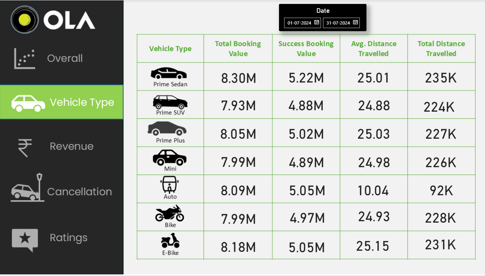
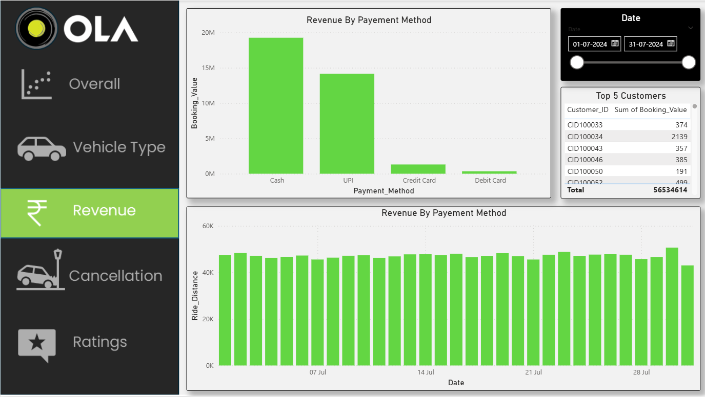
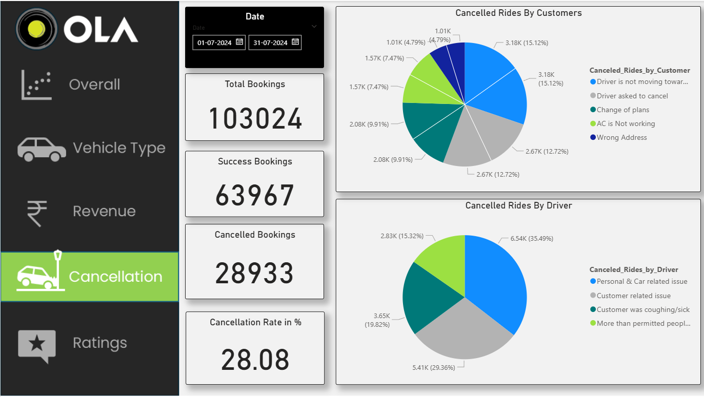
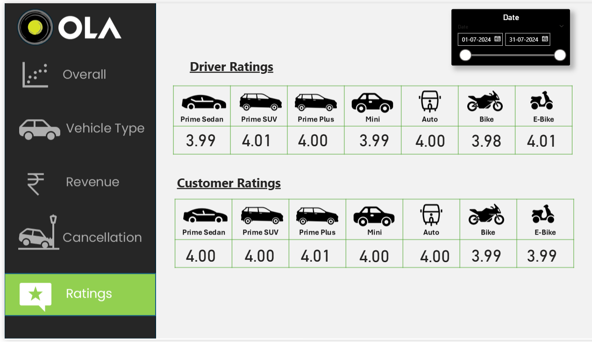

📊 Ola Booking Dashboard – Power BI Project

This project is an interactive Power BI dashboard designed to analyze Ola booking data, providing actionable insights into booking patterns, revenue, cancellations, and performance metrics.

📌 Features Included:

Overall Analysis: Total Bookings & Revenue

Booking Status Breakdown: Success vs. cancellations (by driver, by customer, driver not found)

Ride Volume Over Time: Trend visualization

Vehicle Type Analysis: Car, Bike, Mini Car, etc.

Cancellation & Ratings Analysis

🛠 Tools Used:

Power BI – Data Visualization & Dashboard Creation

MS Excel – Data Cleaning & Preprocessing

📈 Insights Derived:

High success rate of 62% bookings

Clear patterns of peak vs. low booking periods

Major reasons for cancellations identified.

✅ Dashboard Preview:

